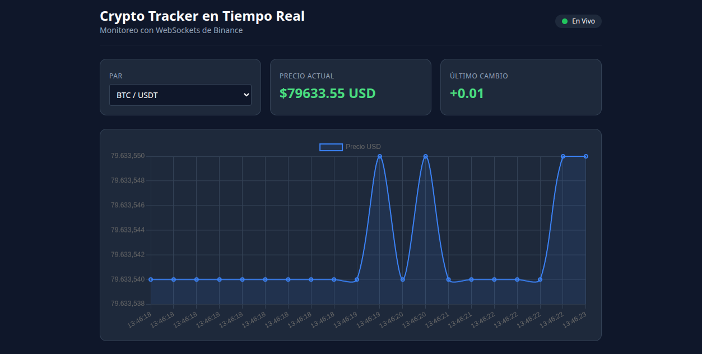

🚀 Real-Time Crypto Tracker & Alert Engine


Un dashboard financiero de alto rendimiento diseñado para monitorear precios de criptomonedas en tiempo real. Utiliza un backend asíncrono con **FastAPI** que consume los WebSockets oficiales de **Binance** y transmite métricas procesadas a un frontend interactivo con **Chart.js** y **Tailwind CSS**.

---

## 📌 Arquitectura del Sistema
┌─────────────────┐      WebSocket Stream      ┌─────────────────────┐
│  Binance API    │ ─────────────────────────> │   FastAPI Backend   │
└─────────────────┘                            └──────────┬──────────┘
│ WebSocket (ws://127.0.0.1:8000/ws)
▼
┌─────────────────────┐
│ HTML5 / JS Frontend │
│ (Chart.js + Tailwind)│
└─────────────────────┘

---

## ✨ Características Principales

- **Conexión en Tiempo Real:** Transmisión de precios con latencia ultra baja a través de WebSockets (`wss://stream.binance.com`).
- **Backend Asíncrono:** Desarrollado con **FastAPI** y `asyncio` para el manejo concurrente de múltiples clientes WebSocket.
- **Visualización Dinámica:** Gráficas en vivo con actualización automática punto a punto alimentadas por **Chart.js**.
- **Suscripción Multipar:** Interfaz para seleccionar pares de trading principales (BTC/USDT, ETH/USDT, SOL/USDT, BNB/USDT).
- **Indicador de Variación:** Cálculo instantáneo de fluctuación de precios con resaltado visual (verde/rojo).
- **Entorno Aislado:** Manejo estricto de dependencias mediante entornos virtuales de Python (`venv`).

---

## 🛠️ Tecnologías Utilizadas

### Backend
- **Python 3.10+**
- **FastAPI:** Framework web asíncrono de alto rendimiento.
- **Uvicorn:** Servidor ASGI para ejecución en producción y desarrollo.
- **WebSockets / aiohttp:** Cliente y servidor para streams bidireccionales.

### Frontend
- **HTML5 & JavaScript ES6+**
- **Tailwind CSS (CDN):** Estilizado moderno y responsivo en modo oscuro (*Dark Mode*).
- **Chart.js:** Renderizado de gráficos interactivos tipo serie temporal.

---

## 📂 Estructura del Proyecto

```text
cripto-dashboard/
├── backend/
│   ├── main.py                # Aplicación FastAPI y servidor WebSocket
│   ├── requirements.txt       # Dependencias del proyecto Python
│   └── venv/                  # Entorno virtual de Python (ignorado en git)
├── frontend/
│   ├── index.html             # Interfaz de usuario (Dashboard)
│   └── app.js                 # Cliente WebSocket y lógica de Chart.js
├── images/                    # Capturas de pantalla
├── .gitignore                 # Archivos excluidos del control de versiones
└── README.md                  # Documentación del proyecto

```

